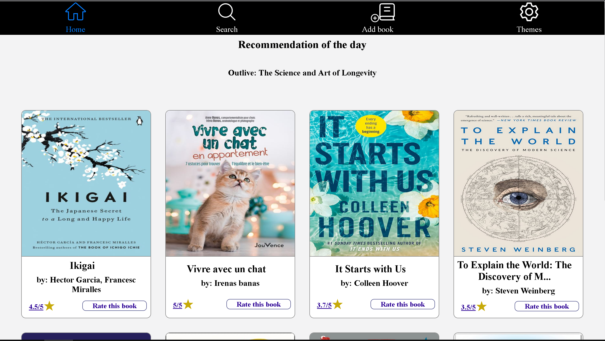

# BookLibrairyProject
In development:

My very first full stack app, using Sql server (Azure DataStudion v1.41.2) , Entity framework code first approach,.Net 7.0 , React and css as frontend, this app is an assignment from Salt bootcamp where I had 24 hours to build a fullstack CRUD application  and being responsive design.

I decided to create a simple application for users to share with others the books and stories they had read and share their opinion about them. As it is often difficult to choose which book to read, the application propose a book to read among the various books already published in the application.

Initialy I had three tables user,Books and Opinions.For that assignment I have decided to have focus on the one to many relation between Books and Opinions first and managing the corresponding CRUD operations before going further with the User table.

So for every review added a virtual book is generated with the related review informations and so far it looks like this:

New backend in developpement for improvement and good practise : https://github.com/PhilippeLeopoldie/bookLibraryBackend

# Technologies

Azure Sql Database

Entity framework code first approach

ASP.NET Core Web APIs

database : postGres
server: Vercel

Test driven developpement : XunitTest on going, integration tests coming...

React (Typescript)

# deploying link:
2023/04/20 08:30AM (GMT+2): due to the end of my azure subscription I have switched to an in memory database

2023/06/16 new backend in developpement deployed on heroku platform: https://leopoldie-booklibrary-backend.herokuapp.com/

