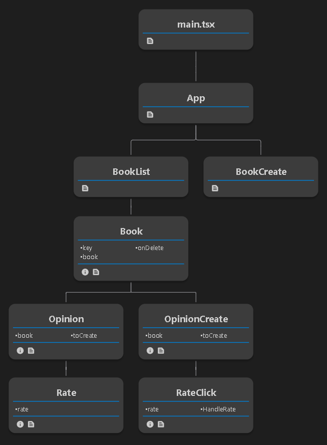

# BookLibraryProject
This is a full stack application, this repository contains the [Frontend](https://github.com/PhilippeLeopoldie/BooksLibraryProject/tree/master/frontend/LibrairyFrontEnd) and the backend is [here](https://github.com/PhilippeLeopoldie/bookLibraryBackend)

## Story 

Initialy this app was a hack day assignment from Salt bootcamp  where I had 24 hours to build a fullstack CRUD application  that is responsive design.

I decided to create a simple application for users to share with others the books that they had read and share their opinion about it.  
As it could be challenging to choose which book to read sometime, the application propose a book to read among the various books already published.

There are three tables: user, Books and Opinions.  
For that assignment I have decided to have focus on the one to many relation between Books and Opinions first and managing the corresponding CRUD operations before going further with the User table.

>Since I have deployed my App the development process follows the  [CI/CD](https://en.wikipedia.org/wiki/CI/CD) principle.

>[The backend](https://github.com/PhilippeLeopoldie/bookLibraryBackend) is implemented using [Entity Framework code first approach](https://learn.microsoft.com/en-us/ef/ef6/get-started)  throw  [TDD](https://en.wikipedia.org/wiki/Test-driven_development)  using [xUnit](https://xunit.net/) framework and [Mock](https://github.com/devlooped/moq) library.

So for every review added a digital book is generated with the related opinion informations.  
here is the components tree:

## Technologies
- [backend](https://github.com/PhilippeLeopoldie/bookLibraryBackend)
  - .Net 7.0.203

  - ASP.NET Core Web APIs

  - API platform: Heroku

  - Database platform: Vercel

    - Database : postGres

- [Frontend](https://github.com/PhilippeLeopoldie/BooksLibraryProject/tree/master/frontend/LibrairyFrontEnd)

  - platform: Vercel

  - React 18.2.0

  - TypeScript

  - CSS

  - HTML

## Deploying links

[Frontend](https://books-library-philippe-leopoldie.vercel.app/)

Backend:
  - Example of end points  
    [getBooks](https://booklibrary-backend-20f7a19cecb2.herokuapp.com/api/book)  
    [getOpinions](https://booklibrary-backend-20f7a19cecb2.herokuapp.com/api/Opinion)

