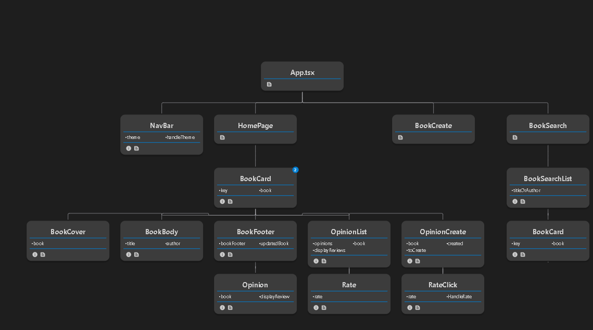

# BookLibraryProject
This is a full stack application, this repository contains the [Frontend](https://github.com/PhilippeLeopoldie/BooksLibraryProject/tree/master/frontend/LibraryFrontEnd) and the backend is [here](https://github.com/PhilippeLeopoldie/bookLibraryBackend)

## Presentation 

Initialy this app was a hack day assignment from Salt bootcamp  where I had 24 hours to build a fullstack application  that is responsive design.

I decided to create a simple application for users to share with others the books that they had read and share their opinion about it.  
As it could be challenging to choose which book to read sometime, the application propose a book to read among the various books already published.

There are two tables:  Books and Opinions.  
For that assignment I have decided to have focus on managing the relationship between books and their corresponding opinions.

Since I have deployed my App the development process follows the <span style = "color: green"> [CI/CD](https://en.wikipedia.org/wiki/CI/CD) </span>principle.


[The backend](https://github.com/PhilippeLeopoldie/bookLibraryBackend) is implemented using <span style = "color: green">[Entity Framework code first approach](https://learn.microsoft.com/en-us/ef/ef6/get-started) </span> throw <span style = "color: green"> [TDD](https://en.wikipedia.org/wiki/Test-driven_development) </span> using <span style = "color: green">[xUnit](https://xunit.net/) </span>framework and <span style = "color: green">[Mock](https://github.com/devlooped/moq) </span>library.


## Installation and Setup

### Backend
1. **Clone the Backend Repository:**
    ```bash
    git clone https://github.com/PhilippeLeopoldie/bookLibraryBackend.git
    ```

2. **Navigate to the Backend Directory:**
    ```bash
    cd bookLibraryBackend
    ```

3. **Install Global Tools:**
    ```bash
    dotnet tool install -g dotnet-aspnet-codegenerator
    dotnet tool install -g dotnet-ef
    ```

4. **Install Dependencies:**
    ```bash
    dotnet restore
    ```

5. **Add Entity Framework Tools:**
    ```bash
    dotnet add package Microsoft.EntityFrameworkCore.Tools
    ```

6. **Add Entity Framework Design:**
    ```bash
    dotnet add package Microsoft.EntityFrameworkCore.Design
    ```

7. **Add CodeGeneration.Design (if needed):**
    ```bash
    dotnet add package Microsoft.VisualStudio.Web.CodeGeneration.Design -version 6
    ```

8. **Add Database Provider (Choose one):**
    ```bash
    dotnet add package Npgsql.EntityFrameworkCore.PostgreSQL
    ```

9. **Run the Backend Locally:**
    ```bash
    dotnet run
    ```
    - The backend should now be running at:
        - HTTP: [http://localhost:5281](https://localhost:5281)  
        - Swagger UI: [http://localhost:5281/swagger/index.html](http://localhost:5281/swagger/index.html)
        
### Frontend
 **Note**: Ensure you have installed:
 - [Node.js](https://nodejs.org/) version: 18.15.0 
 - [npm](https://www.npmjs.com/)  version: 9.5.0
    

1. **Clone the Frontend Repository:**
    ```bash
    git clone https://github.com/PhilippeLeopoldie/BooksLibraryProject.git
    ```

2. **Navigate to the Frontend Directory:**
    ```bash
    cd BooksLibraryProject/frontend/LibraryFrontEnd
    ```

3. **Install Vite:**
    ```bash
    npm install -g create-vite
    ```

4. **Update the API URL in URLs.ts:**

    - Open the src/URLs.ts file.

    - Locate the API_URL variable and update it with the appropriate API URL for local or deployment environment.
      - For local environment:
      ```bash
      export const API_URL : string = "https://localhost:7152/api/"
      ```
      - For deployment environment:
      ```bash
      export const API_URL : string = "https://booklibrary-backend-20f7a19cecb2.herokuapp.com/api/" 
      ```

5. **Install Dependencies:**
    ```bash
    npm install
    ```

6. **Run the Frontend Locally:**
    ```bash
    npm run dev
    ```
    - The frontend should now be running locally.
    

## Components diagram


## App Home page:


### Dark mode:


## Technologies

### [Backend](https://github.com/PhilippeLeopoldie/bookLibraryBackend)

  - .Net 7.0.203

  - ASP.NET Core Web APIs
  
  - xUnit 2.4.2
  
  - Moq 4.18.4

  - API platform: Heroku

  - Database platform: Vercel

    - Database : postGres

### [Frontend](https://github.com/PhilippeLeopoldie/BooksLibraryProject/tree/master/frontend/LibraryFrontEnd)

  - platform: Vercel
  
  - Node.js 18.15.0 , npm 9.5.0

  - React 18.2.0

  - TypeScript 4.9.3

  - CSS

  - HTML
  
  - Jest  29.7.0


## Deploying links
### Frontend
[App URL](https://books-library-2023.vercel.app/)

### Backend
  - Example of end points:  
    - [getBooks](https://booklibrary-backend-20f7a19cecb2.herokuapp.com/api/books)  
    - [getOpinions](https://booklibrary-backend-20f7a19cecb2.herokuapp.com/api/Opinions)  
    - Swagger documentation: [http://localhost:5281/swagger/index.html](http://localhost:5281/swagger/index.html)  